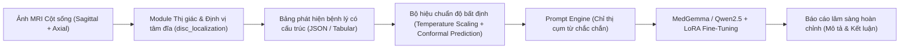

# Calibrated Level-wise Spine MRI Report Generation
### Sinh báo cáo MRI cột sống theo mức có hiệu chuẩn độ bất định dùng mô hình ngôn ngữ y tế và kỹ thuật LoRA

[](https://www.python.org/)
[](https://pytorch.org/)
[](https://huggingface.co/)
[](#)

---

## 📖 Giới thiệu đề tài (Introduction)

Bài toán **Sinh báo cáo chẩn đoán hình ảnh (Medical Report Generation - MRG)** đóng vai trò quan trọng trong việc hỗ trợ bác sĩ giảm tải áp lực gõ văn bản lâm sàng. Với hình ảnh **cộng hưởng từ (MRI) cột sống**, các mô hình AI thường gặp phải 2 thách thức cốt tử:
1. **Lỗi gán sai vị trí giải phẫu (Mislocalization):** Cột sống gồm nhiều tầng đĩa đệm liên tiếp (`L1/L2` đến `L5/S1`). Mô hình sinh văn bản tự do rất dễ bị ảo giác, gán nhầm tổn thương tầng này sang tầng khác.
2. **Tự tin thái quá tại vùng ranh giới liên tục (Overconfident Misclassification):** Thoái hóa hay hẹp ống sống mang tính thứ bậc liên tục (*Bình thường $\to$ Nhẹ $\to$ Vừa $\to$ Nặng*). Việc ép mô hình chọn nhãn cứng (hard label) gây ra sai lầm lâm sàng nguy hiểm.

###  Giải pháp của nghiên cứu:
Dự án đề xuất một **Hệ thống module hóa (Modular Architecture)** kết hợp giữa **Hiệu chuẩn độ bất định (Uncertainty Calibration / Conformal Prediction)** và **Mô hình ngôn ngữ y tế (MedGemma / Qwen2.5) tinh chỉnh bằng kỹ thuật LoRA**:
* **Xử lý theo tầng (Level-wise):** Bóc tách và định vị độc lập 5 tầng đĩa đệm từ `L1/L2` đến `L5/S1`.
* **Hiệu chuẩn xác suất 2 lớp:** Sử dụng *Temperature Scaling* giảm sai số ECE và *Dự báo Conformal* đưa ra tập chẩn đoán có bảo chứng xác suất $1 - \alpha$, cho phép mô hình phát biểu *"chưa phân định được"* thay vì đoán mò.
* **Sinh văn bản có kiểm soát:** Ánh xạ từ chỉ thị bất định sang cụm từ y khoa chuẩn mực, sinh báo cáo chi tiết cho từng tầng (hỗ trợ cả tiếng Việt và tiếng Anh).

---

## 🏗️ Kiến trúc hệ thống (System Architecture)



---

## 📂 Cấu trúc mã nguồn (Repository Structure)

```text
├── dataset/                  # Dữ liệu tinh gọn, sẵn sàng cho huấn luyện (Xem dataset/README.md)
│   ├── dataset_master.csv    # Bảng tổng hợp phẳng 1.235 dòng (247 ca x 5 tầng)
│   ├── dataset_patients.jsonl# Cấu trúc dữ liệu cấp bệnh nhân
│   └── sft_data/             # Bộ dữ liệu Prompt-Response SFT (Fold 1: train/val/test)
├── scripts/                  # Các script tiền xử lý & tiện ích
│   └── consolidate_dataset.py# Script tự động tổng hợp từ dữ liệu phân mảnh
├── src/                      # Mã nguồn cốt lõi (Core modules)
│   ├── calibration/          # Module Temperature Scaling & Conformal Prediction (Upcoming)
│   ├── models/               # Tích hợp MedGemma / LoRA PEFT (Upcoming)
│   └── evaluation/           # Đánh giá ECE, Coverage, BLEU, ROUGE, Clinical F1 (Upcoming)
├── .gitignore                # Bảo vệ dữ liệu bệnh nhân và model weights
└── README.md                 # Tài liệu này
```

---

## 🚀 Hướng dẫn bắt đầu nhanh (Quickstart)

### 1. Cài đặt môi trường
```bash
git clone https://github.com/kttt294/MRI-report-generator.git
cd MRI-report-generator

python -m venv venv
# Trên Windows:
venv\Scripts\activate
# Trên Linux/macOS:
source venv/bin/activate

pip install -r requirements.txt
```

### 2. Chuẩn bị dữ liệu
Chạy script tổng hợp dữ liệu từ thư mục `dataset_local/`:
```bash
python scripts/consolidate_dataset.py
```
Toàn bộ dữ liệu sạch, đã gắn nhãn và chia 5-fold cross validation sẽ được tạo tự động tại thư mục `dataset/`.

---

## 📊 Tiêu chí đánh giá (Evaluation Protocol)

Nghiên cứu đánh giá đa chiều trên 3 trục:
1. **Chất lượng sinh ngôn ngữ (NLP Metrics):** BLEU-1/2/4, ROUGE-1/L, METEOR, BERTScore.
2. **Độ tin cậy & Hiệu chuẩn xác suất (Calibration Metrics):** ECE (Expected Calibration Error), MCE (Maximum Calibration Error), Empirical Coverage Rate ($1 - \alpha$).
3. **Độ chính xác lâm sàng (Clinical Efficacy F1):** Trích xuất thực thể bệnh lý (Thoát vị, Hẹp ống sống, Modic, Phình đĩa đệm) so với Ground Truth bác sĩ.

---

## 📜 Điều kiện sử dụng & Bản quyền dữ liệu
Dữ liệu nghiên cứu gốc (PSPINES) là dữ liệu bệnh nhân đã được khử định danh theo chuẩn **DICOM PS3.15**. Để đảm bảo đạo đức nghiên cứu y sinh, dữ liệu ảnh gốc và thông tin bệnh nhân không được phân phối công khai và đã được loại trừ khỏi kho mã nguồn thông qua `.gitignore`.
